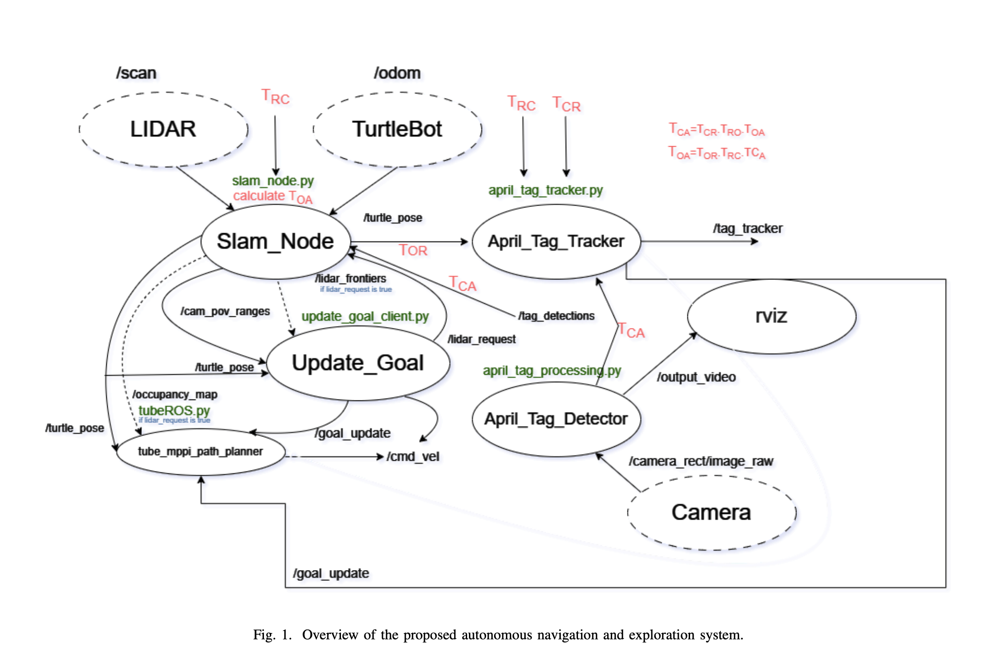
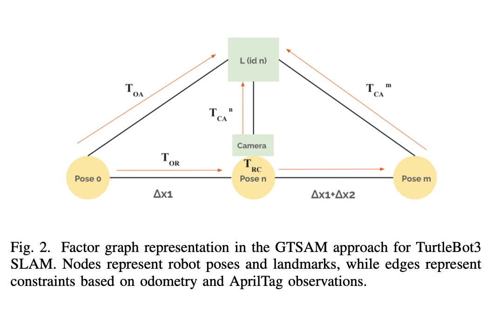

# TurtleBot3 Autonomous Navigation and Exploration System

## Overview

This project presents a comprehensive system for autonomous navigation, mapping, and exploration using a TurtleBot3 robot. The system integrates multiple advanced techniques, such as April Tag detection and tracking, Simultaneous Localization and Mapping (SLAM) using GTSAM factor graphs, frontier-based goal generation, and Tube Model Predictive Path Integral (MPPI) control. The project has been tested in simulated and real environments, yielding promising results, though there are areas for improvement.

### Key Components
- **April Tag Detection and Tracking**: Uses the pupil-apriltags package to detect fiducial markers in the robot’s camera feed, enabling reliable landmark localization for SLAM.
- **SLAM (Simultaneous Localization and Mapping)**: Employs the GTSAM library to create a factor graph of the robot’s pose and surrounding landmarks using data from LIDAR and April Tags.
- **Frontier-Based Goal Generation**: Uses LIDAR and camera fusion to identify exploration goals at the frontier between known and unknown areas of the environment.
- **Tube MPPI (Model Predictive Path Integral) Control**: This algorithm generates smooth, collision-free trajectories while accounting for system noise, improving navigation accuracy.

---

## System Architecture



The system is built from the following modules:
1. **April Tag Detection**: Detects April Tags and estimates their pose relative to the robot.
2. **SLAM with GTSAM**: Constructs a factor graph for pose estimation and landmark mapping.
3. **Frontier Exploration**: Identifies and selects exploration targets based on the robot’s current map.
4. **Tube MPPI Control**: Generates the robot's motion trajectory using a combination of sampling-based path planning and ancillary control.

---

## Setup Instructions

### 1. Establish SSH Connection Between the Robot and Host PC

Open a terminal and establish a connection with the TurtleBot3:

```bash
ssh ubuntu@IP_ADDRESS_OF_RASPI_ON_ROBOT
```

### 2. Update `.bashrc` File on Both Devices

#### On the TurtleBot (Robot)

```bash
echo "export ROS_MASTER_URI=http://IP_ADDRESS_OF_REMOTE_PC:11311" >> ~/.bashrc
echo "export ROS_HOSTNAME=IP_ADDRESS_OF_RASPI_ON_ROBOT" >> ~/.bashrc
```

#### On the Host PC

```bash
echo "export ROS_MASTER_URI=http://IP_ADDRESS_OF_REMOTE_PC:11311" >> ~/.bashrc
echo "export ROS_HOSTNAME=IP_ADDRESS_OF_REMOTE_PC" >> ~/.bashrc
```

### 3. Start the TurtleBot Bringup on the Robot

On the robot, start the TurtleBot:

```bash
roslaunch turtlebot3_bringup turtlebot3_robot.launch
```

### 4. Run ROS Core on the Host PC

In another terminal on the host PC, run:

```bash
roscore
```

### 5. Start the Master Launch File

Finally, on the host PC, launch the main application:

```bash
roslaunch squirtle master.launch
```

---

## System Design and Components


### TurtleBot3 Transformations and Camera Setup

The TurtleBot3’s kinematic chain integrates a camera into its URDF file, ensuring precise transformations for pose estimation. Camera calibration was performed using ROS's Monocular Camera Calibration tool.

### GTSAM Factor Graph




GTSAM optimizes the SLAM process using a factor graph approach. It constructs the graph incrementally as the robot navigates, connecting consecutive robot poses through odometry measurements and integrating April Tags as landmarks for enhanced localization accuracy.

### April Tag Detection and Tracking

April Tags detected in the environment provide relative pose information, enabling the robot to track landmarks continuously. This tracking information is integrated into the SLAM module for optimized path planning and navigation.

### Tube MPPI Control

Tube MPPI improves navigation under system noise. The combination of MPPI and ancillary controllers ensures smooth trajectories and efficient exploration.

---


## Contribution of Team Members

- **German Gonzalez**: April Tag detection, SLAM node integration, debugging.
- **Saicharan Thirandas**: Frontier detection, TurtleBot setup, integration.
- **Seung Hun Lee**: Tube MPPI implementation.
- **Puja Chaudhary**: Collision avoidance, Tube MPPI integration.
- **Yiqi Dou**: Camera calibration and testing.

---

## Images

Include the following images to illustrate various stages of the system:

- **April Tag Detection in Gazebo and Real Environment**: Displays the successful detection of April Tags.
- **Mapping Results**: Shows mapping results in both the Gazebo simulation and real-world environments.

---

## References

- S. Thrun, Robotic Mapping: A Survey. Morgan Kaufmann, 2002.
- C. Cadena et al., "Past, present, and future of SLAM," IEEE Transactions on Robotics, 2016.
- B. Yamauchi, "A frontier-based approach for autonomous exploration," IEEE International Symposium on Computational Intelligence, 1997.

---
